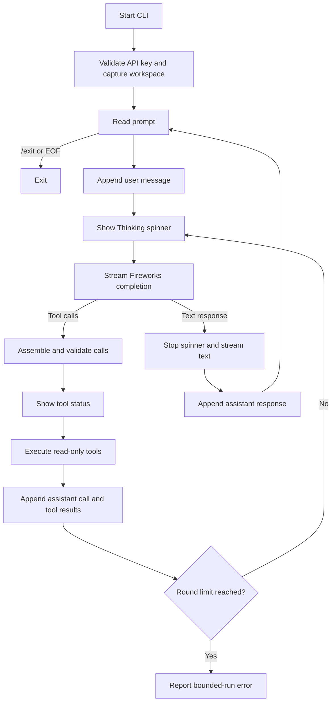

# Smith Agent PoC Implementation Plan

## Purpose

Validate whether a small Rust CLI can provide a useful coding-agent experience with Fireworks AI. This is not a production agent.

## Resolved decisions

- **D1:** Build a read-only coding agent with model-directed filesystem tools, not a chat-only client.
- **D2:** Run as an interactive session with in-memory conversation history. Exit with `/exit` or `Ctrl+C`.
- **D3:** Show animated status during model and tool activity, then stream the final answer.
- **D4:** Judge the PoC with three manual coding scenarios plus safety and resilience checks.

## PoC boundary

### Included

- Interactive terminal prompt.
- Fireworks OpenAI-compatible chat-completions API.
- Model: `accounts/fireworks/models/kimi-k2p6`.
- Base URL: `https://api.fireworks.ai/inference/v1`.
- Streaming responses and streaming tool-call assembly.
- Three read-only tools:
  - `list_files`
  - `read_file`
  - `search_files`
- In-memory conversation history for the process lifetime.
- Workspace confinement to the directory where the CLI starts.
- Spinner/status updates for model requests and tool execution.
- Fixed limits on agent rounds and tool output.
- Focused automated tests for path confinement and streamed tool-call assembly.

### Excluded

- File writes, patches, or shell commands.
- Confirmation prompts; all available tools are read-only.
- Saved or resumable sessions.
- Multiple model providers or configurable models.
- Full-screen TUI, Markdown rendering, syntax highlighting, or multiline editing.
- Repository indexing, embeddings, MCP, sub-agents, or parallel tool execution.
- Production retry, telemetry, authentication storage, or cost accounting.

## Technical approach

### Dependencies

Use the smallest direct stack:

- `tokio`: async runtime.
- `reqwest`: HTTPS and response byte streaming.
- `serde`, `serde_json`: Fireworks messages, tool schemas, and tool arguments.
- `futures-util`: consume the HTTP byte stream.
- `eventsource-stream`: correctly decode server-sent events instead of maintaining a custom SSE parser.
- `indicatif`: terminal spinner/status animation.
- `walkdir`: bounded recursive file listing and search.
- `anyhow`: concise application-level error context.

Do not add `clap`, a TUI framework, an agent framework, or an OpenAI SDK. The PoC has no command-line options, and implementing the small OpenAI-compatible payload directly keeps model/tool behavior visible.

### Proposed files

```text
.
├── Cargo.toml
├── Taskfile.yml
├── README.md
├── CONTEXT.md
├── docs/
│   └── POC-IMPLEMENTATION-PLAN.md
├── src/
│   ├── main.rs
│   ├── agent.rs
│   ├── fireworks.rs
│   └── tools.rs
└── tests/
    └── fixtures/
        └── sample-project/
```

Responsibilities:

- `main.rs`: read `API_KEY_FIREWORKS` (PowerShell: `$env:API_KEY_FIREWORKS`), capture workspace root, run the REPL, and own terminal output.
- `agent.rs`: maintain message history and execute the model → tool → model loop.
- `fireworks.rs`: define request/stream types, call `/chat/completions`, parse SSE deltas, and assemble content/tool calls.
- `tools.rs`: define JSON schemas, validate arguments, confine paths, execute tools, and bound results.

Keep the final shape flexible while implementing; combine modules if they remain trivial.

## Runtime flow



## Fireworks contract

Send `POST https://api.fireworks.ai/inference/v1/chat/completions` with bearer authentication from `API_KEY_FIREWORKS` (PowerShell: `$env:API_KEY_FIREWORKS`).

Use these fixed PoC request values:

```json
{
  "model": "accounts/fireworks/models/kimi-k2p6",
  "stream": true,
  "stream_options": {
    "include_usage": true,
    "include_internal_content": false
  },
  "tool_choice": "auto",
  "parallel_tool_calls": false,
  "temperature": 0.1,
  "max_tokens": 1024
}
```

The request also includes the full in-memory `messages` list and all three tool schemas. Preserve the assistant's complete `tool_calls` message, then append one `role: "tool"` message per result using the matching `tool_call_id`.

Streaming details:

- Decode SSE frames until `data: [DONE]`.
- Print `delta.content` immediately once final text begins.
- Accumulate tool calls by their streamed `index` because IDs, names, and JSON arguments can arrive across multiple chunks.
- Ignore hidden reasoning content for this PoC.
- Execute tool calls only after the stream completes and arguments parse as JSON.

Fireworks documents streaming tool calls and recommends low temperature, explicit and distinct tool schemas, and an explicit `max_tokens` for Kimi K2 agent workflows.

## Agent loop

1. Add the user prompt to session history.
2. Request a streamed completion with `tool_choice: "auto"`.
3. If the completion contains tool calls:
   1. Add the assistant tool-call message to history.
   2. Validate each function name and JSON argument object.
   3. Execute returned calls sequentially.
   4. Add each result as a tool message.
   5. Repeat the model request.
4. If the completion contains final text, add it to history and return to the REPL.
5. Abort the run after 12 model rounds with a clear message. Preserve the session so the next prompt still works.

A fixed round limit prevents accidental long loops and uncontrolled API cost without introducing configuration machinery.

## Tool contracts

### `list_files`

Input:

```json
{"path":"."}
```

Behavior:

- Recursively return relative file paths below `path`.
- Do not follow symlinks.
- Skip `.git` and `target` directories.
- Return at most 500 paths and state when truncated.

### `read_file`

Input:

```json
{"path":"src/main.rs"}
```

Behavior:

- Read UTF-8 text only.
- Reject directories, binary/non-UTF-8 content, and files over 128 KiB.
- Return line-numbered text so the model can cite locations.

### `search_files`

Input:

```json
{"query":"Agent","path":"src"}
```

Behavior:

- Perform case-sensitive literal substring search over UTF-8 files.
- Do not follow symlinks; skip `.git` and `target`.
- Skip files over 128 KiB.
- Return relative path, line number, and matching line.
- Return at most 100 matches and state when truncated.

Literal search is intentional for the PoC. Regex or ripgrep integration is an upgrade only if evaluation shows search quality is the blocker.

## Workspace confinement

Treat model-generated tool arguments as untrusted input.

- Canonicalize the launch directory once as the workspace root.
- Reject absolute paths.
- Join each relative argument to the root, canonicalize the existing target, and require it to start with the canonical root.
- Reject `..` traversal and symlinks whose canonical targets leave the root.
- Never follow symlinks during recursive walks.
- Return tool errors to the model as results rather than ending the CLI.

## Terminal behavior

- Startup: print the workspace path and model name.
- Prompt: `smith> `.
- Model wait: animated `Thinking...` spinner.
- Tool activity: replace the spinner message with concise status such as `Reading src/main.rs` or `Searching "Agent" in src`.
- Final answer: clear the spinner, print content chunks as received, flush stdout, then print a newline.
- `/exit`, EOF, or `Ctrl+C`: terminate without a stack trace.
- API and tool errors: print one concise error and return to the prompt where possible.

Use normal line input. Rich editing and persistent command history do not help answer the PoC hypothesis.

## Implementation sequence

### I1 — Scaffold and runnable CLI

- Create the Rust binary and dependencies.
- Add `Taskfile.yml` with `default`, `run`, `test`, `check`, and `clean`; `default` runs `task --list`.
- Add startup configuration and a basic prompt loop.
- Document `$env:API_KEY_FIREWORKS` setup for PowerShell in `README.md`.

Verify:

- `task run` opens `smith> `.
- `/exit`, EOF, and `Ctrl+C` exit cleanly.
- Missing `API_KEY_FIREWORKS` reports an actionable error.

### I2 — Implement confined read-only tools

- Define tool schemas and dispatcher.
- Implement path validation and bounded list/read/search operations.
- Add tests for valid paths, `..`, absolute paths, escaping symlinks, oversized files, and truncation.

Verify:

- `cargo test tools` passes.
- No test can read outside its temporary workspace.

### I3 — Implement Fireworks streaming client

- Add request/message structs.
- Decode SSE events.
- Accumulate streamed text and indexed tool-call fragments.
- Add fixture-based parser tests using representative SSE chunks, including split JSON arguments.

Verify:

- Parser reconstructs final text and complete tool calls.
- A malformed event yields an actionable error rather than a panic.

### I4 — Implement the agent loop

- Add system prompt and in-memory history.
- Send all tool schemas with every request.
- Execute tool calls, append matching tool messages, and continue until final text.
- Enforce the 12-round limit.

Verify:

- A mocked stream can exercise model → tool → model without network access.
- Assistant tool calls and tool results retain matching IDs.

### I5 — Add terminal animation and live output

- Show spinner during model waits and tool execution.
- Clear it before streaming final content.
- Flush each content chunk.

Verify:

- No spinner remains after completion or error.
- Tool statuses and final streamed text remain readable in a normal terminal.

### I6 — Run the PoC evaluation

Use `tests/fixtures/sample-project` or another small known repository and record pass/fail in the README.

1. Ask: `Explain this repository's structure and main execution flow.`
2. Ask: `Where is <named behavior> implemented, and how does it work?`
3. Ask: `Answer <known code question> and cite the relevant file paths.`

For each scenario, verify:

- At least one model-directed tool call occurred.
- The response is factually correct against the fixture.
- Relevant file paths are cited.
- Activity animation is visible and final text streams.
- The next prompt works in the same session.

Also manually attempt `read_file` with `../...` through a direct unit test or forced tool fixture and confirm rejection.

## Confirm or deny gate

**Confirm this path** when all three scenarios pass, the model independently selects useful tools, answers are grounded in inspected files, and the interaction feels responsive enough to continue investing.

**Deny or reconsider this path** when any of these persist after fixing obvious prompt/schema defects:

- Kimi K2.6 does not reliably emit valid tool calls.
- The model repeatedly loops or chooses irrelevant tools.
- Correct grounded answers require adding write/shell/indexing features before read-only investigation is useful.
- Streaming latency makes the interactive experience unacceptable.
- Fireworks availability or per-run cost is incompatible with expected use.

If denied, retain the tool and SSE tests; they isolate whether the failure is the model/provider, the agent loop, or the product concept.

## Known PoC limitations

- Repository content can prompt-inject the model, though read-only tools cap impact.
- Conversation history is unbounded for the session; long sessions may eventually hit context or cost limits.
- Literal search is weaker than ripgrep and does not honor `.gitignore` beyond the explicit directory skips.
- Tool execution is sequential.
- API calls can be slow. Fireworks recommends a 10–30 minute read timeout for Kimi K2 agentic calls; use a 10-minute PoC timeout so failures remain bounded.

## Primary references

- [Fireworks Chat Completions API](https://docs.fireworks.ai/api-reference/post-chatcompletions)
- [Fireworks tool calling guide](https://docs.fireworks.ai/guides/function-calling)
- [Fireworks Kimi K2 family guidance](https://docs.fireworks.ai/models/kimi-k2)
- [Kimi K2.6 model page](https://fireworks.ai/models/fireworks/kimi-k2p6)
